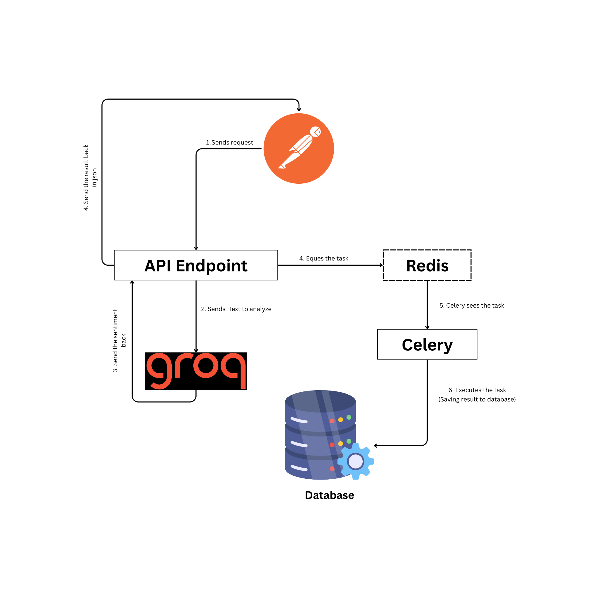

# 12factor_sentimetAnalyzer

<a target="_blank" href="https://cookiecutter-data-science.drivendata.org/">
    
</a>

Sentiment Analyzer API is a FastAPI application designed for sentiment analysis, powered by Groq’s LLaMA 4 model. It efficiently processes input text to determine sentiment using advanced natural language understanding. The application integrates Celery for asynchronous background task processing and PostgreSQL for reliable data storage. Docker is utilized to streamline deployment and ensure a consistent, containerized environment.

---

## Local Setup through Docker

### Cloning the repository

```
git clone https://github.com/Sundess/12factor_sentimentanalyzer
cd 12factor_sentimentanalyzer
```

### ⚙️ Environment Configuration

Change `.env_change` file in the root directory to `.env' and add your groq api key

```env
GROQ_API_KEY=your_groq_api_key
```

### Running docker-compose for building the application

```
docker compose up --build
```

### Access the api through endpoints

```
http://localhost:8000/
```

#### 🧪 API Endpoints

The application’s API endpoints are defined in main.py under the app directory, using the FastAPI framework to handle HTTP requests and responses efficiently.

`GET /`

Returns a welcome message:

```json
{
  "message": "Welcome to Homepage"
}
```

`POST /analyze/`

Analyzes user-provided text and returns the sentiment.

**Request Body:**

```json
{
  "text": "I love this product!"
}
```

**Response:**

```json
{
  "text": "I love this product!",
  "sentiment": "Positive"
}
```

A background Celery task is triggered to save this information in the database.

---

## 📂 Folder Structure

```plaintext
root/
├── app/
│   ├── main.py                  # FastAPI app and endpoint definitions
│   └── sentiment_analyzer.py   # Calls Groq API to analyze sentiment
├── workers/
│   ├── db_saver_celery_worker.py  # Celery app initialization
│   └── tasks.py                   # Task to save data to PostgreSQL
├── .env                        # Environment variables
├── requirements.txt            # Python dependencies
├── Dockerfile                  # Docker image setup
├── docker-compose.yml          # Multi-container orchestration
└── docs/                       # MkDocs source
```

---

## Project Workflow


