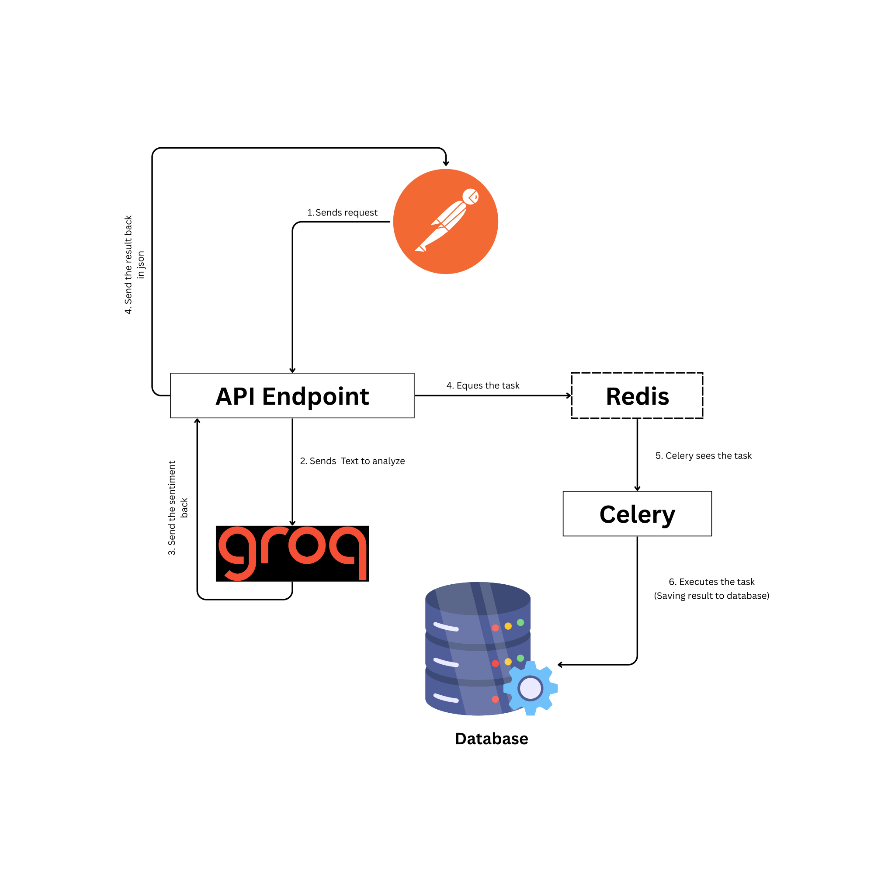

# Sentiment Analyzer API Docs

## About

**Sentiment Analyzer API** is a FastAPI application designed for sentiment analysis, powered by Groq’s LLaMA 4 model. It efficiently processes input text to determine sentiment using advanced natural language understanding. The application integrates Celery for asynchronous background task processing and PostgreSQL for reliable data storage. Docker is utilized to streamline deployment and ensure a consistent, containerized environment.

---

## 12 Factor Application Implementation

1. Codebase : Utilized Git for version tracking, following git best practices
2. Dependencies : Dependencies are stored in seperate python virtual environment.
3. Config : .env file has been setup for API Key confriguation
4. Backing Services : The app accesses services via credentials stored in environment variables.
5. Build, Release, Run : Utilized a Dockerfile to define the build process
6. Processes : Runs as a stateless and share-nothing process
7. Port Binding : Runs on a specific port that has been binded in dockerfile
8. Concurrency : Worker node has been utilized to handel concurrency with help of redis.
9. Disposability : Not utilzed
10. Dev/Prod Parity : Run local environments that closely approximate production environments.
11. Logs : Not utilized
12. Admin Processes: Leveraged Celery to execute asynchronous background tasks for saving data into the database, emulating one-time administrative operations such as data imports or cleanup jobs, in line with 12-Factor App best practices.

## 🚀 Tech Stack

- **Framework**: FastAPI
- **Background Jobs**: Celery
- **Message Broker**: Redis
- **Database**: PostgreSQL
- **AI Model**: Groq Meta-LLaMA-4 (Scout)
- **Environment Variables**: `.env`

## Project Flow

